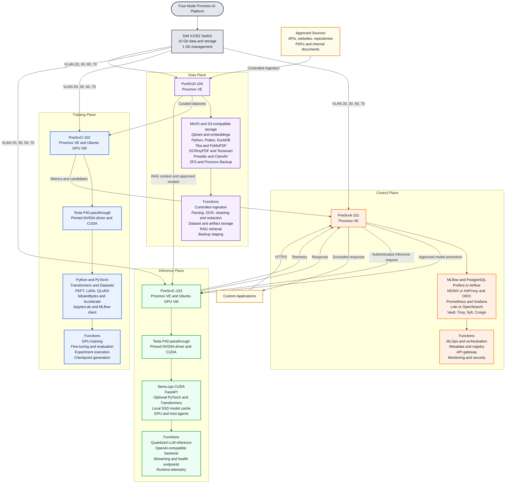
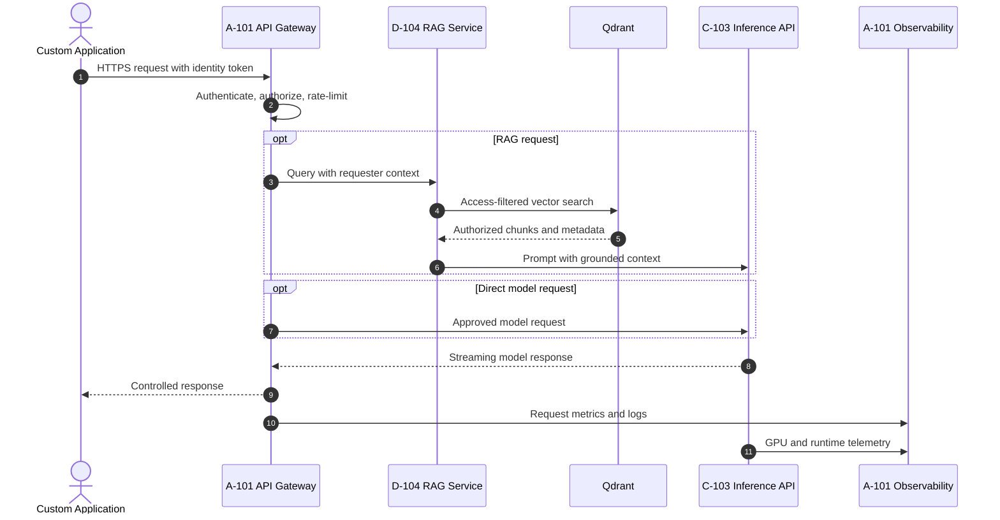

# Four-Node Proxmox AI Platform

Interactive GitHub documentation for the server deployment, technology stack, platform functions, network zones, and end-to-end AI workflow.

> **Interaction:** Select a server node in the diagram to jump to its detailed section. GitHub renders Mermaid diagrams natively. Browser zoom and pan can be used for large diagrams.

## Interactive Server Deployment Map

## PveSrvA-101 Control Plane

| Area | Technology stack | Function |
|---|---|---|
| Hypervisor | Proxmox VE | Hosts control-plane services |
| MLOps | MLflow, PostgreSQL | Experiment tracking, metadata, registry, lineage |
| Orchestration | Prefect or Airflow, CI/CD agent | Coordinates data, training, evaluation, and deployment workflows |
| API access | NGINX or HAProxy, OIDC | TLS termination, authentication, routing, and rate limiting |
| Observability | Prometheus, Grafana, Loki or OpenSearch | Metrics, dashboards, logs, and operational visibility |
| Security | Vault, Trivy, Syft, Cosign | Secrets, scanning, SBOM generation, and signing |

[Back to diagram](#interactive-server-deployment-map)

## PveSrvC-102 Training Plane

| Area | Technology stack | Function |
|---|---|---|
| Compute | Tesla P40 PCI passthrough, Ubuntu GPU VM | Dedicated GPU training environment |
| Runtime | Pinned NVIDIA driver and CUDA | Stable Pascal-compatible execution baseline |
| ML framework | Python, PyTorch, Transformers, Datasets, Tokenizers | Model loading, training, tokenization, and evaluation |
| Adaptation | PEFT, LoRA, QLoRA, bitsandbytes | Parameter-efficient fine-tuning and validated quantization |
| Execution | Accelerate, JupyterLab | Job launch and controlled experimentation |
| Tracking | MLflow client | Records metrics, parameters, artifacts, and lineage |
| Storage | Local SSD or NVMe scratch | Tokenized shards, caches, and active checkpoints |

[Back to diagram](#interactive-server-deployment-map)

## PveSrvC-103 Inference Plane

| Area | Technology stack | Function |
|---|---|---|
| Compute | Tesla P40 PCI passthrough, Ubuntu GPU VM | Dedicated inference environment |
| Runtime | llama.cpp CUDA or validated pinned PyTorch | Quantized and approved-model inference |
| API | FastAPI | Private OpenAI-compatible backend and health endpoints |
| Cache | Local SSD model cache | Faster startup and reduced network reads |
| Monitoring | GPU and host agents | VRAM, utilization, temperature, latency, and API telemetry |
| Access | A-101 gateway and approved RAG service only | Prevents direct application access to model workers |

[Back to diagram](#interactive-server-deployment-map)

## PveSrvD-104 Data Plane

| Area | Technology stack | Function |
|---|---|---|
| Object storage | MinIO or S3-compatible storage | Raw, curated, dataset, checkpoint, model, and audit artifacts |
| Data processing | Python, Polars, DuckDB | ETL, validation, cleaning, curation, and analytical transforms |
| Document processing | Tika, PyMuPDF, OCRmyPDF, Tesseract | Parsing and OCR for documents and scanned content |
| Data protection | Presidio, ClamAV | PII detection and redaction, malware scanning, and quarantine |
| RAG | Embedding service, Qdrant, optional reranker | Vector generation, indexing, retrieval, and ranking |
| Recovery | ZFS, Proxmox Backup Server | Backup staging, retained copies, and platform recovery |

[Back to diagram](#interactive-server-deployment-map)

## Application and Inference Flow

## Data, Training, and Model Promotion Flow

```mermaid
flowchart LR
    S[Approved Sources] --> I[Ingestion]
    I --> Q[Validation, Malware Scan, Quarantine]
    Q --> E[Parsing and OCR]
    E --> C[Clean, Deduplicate, Classify, Redact]
    C --> CUR[Approved Curated Data]
    CUR --> DS[Versioned Dataset Release]
    CUR --> CH[Chunking and Embeddings]
    CH --> V[Qdrant Vector Index]
    DS --> T[LoRA, QLoRA, or SFT on C-102]
    T --> EV[Evaluation]
    EV --> M[MLflow and Human Approval]
    M --> SG[Signed Model Package and SBOM]
    SG --> INF[Deployment to C-103]
    INF --> MON[Monitored Inference]
    MON --> DEC{Lifecycle Decision}
    DEC -->|Retrain| T
    DEC -->|Rollback| SG
    DEC -->|Continue| MON
```

## Network Segmentation

| VLAN | Zone | Purpose |
|---:|---|---|
| 10 | iDRAC and out-of-band | Hardware management only |
| 20 | Proxmox management | Hypervisor, cluster, SSH, DNS, and NTP |
| 30 | Storage and data | Datasets, models, checkpoints, object storage, and backup |
| 40 | AI training | Training jobs and controlled artifact access |
| 50 | Inference and application | API gateway, RAG, and model serving |
| 60 | Ingestion DMZ | Allow-listed external acquisition and quarantine |
| 70 | Monitoring and backup | Metrics, logs, exporters, and backup traffic |

### Core Network Controls

- Default-deny inter-VLAN firewall rules.
- No direct Internet access from storage, training, or inference zones.
- Allow-listed egress proxy for ingestion workloads.
- TLS for service endpoints and mTLS where required.
- OIDC, least-privilege RBAC, and separate service identities.
- Private PostgreSQL, MinIO, Qdrant, JupyterLab, Proxmox, iDRAC, and model runtime endpoints.

[Back to diagram](#interactive-server-deployment-map)

## Deployment Priorities

- **P0:** Hardware validation, Proxmox, ZFS, networking, firewalling, GPU passthrough, and backup foundation.
- **P1:** Ingestion, MinIO, Qdrant, RAG, training runtime, inference runtime, API gateway, monitoring, and backup.
- **P2:** Central logging, secrets management, scanning, SBOM, signing, security hardening, and lifecycle automation.
- **P3:** Modern GPU workers, secondary inference, redundant 25 Gb connectivity, dedicated storage, and justified Ceph or Kubernetes adoption.

## GitHub Usage

1. Save this document as `README.md` or another file ending in `.md`.
2. Commit the file to a GitHub repository.
3. Open the file in the GitHub web interface to render the Mermaid diagrams.
4. Select the four primary server nodes in the first diagram to navigate to their detail sections.
5. If a GitHub environment blocks Mermaid links, use the section links below the diagram as the navigation fallback.

## Source

Adapted from the Four-Node Proxmox AI Platform complete solution architecture and deployment guide.
